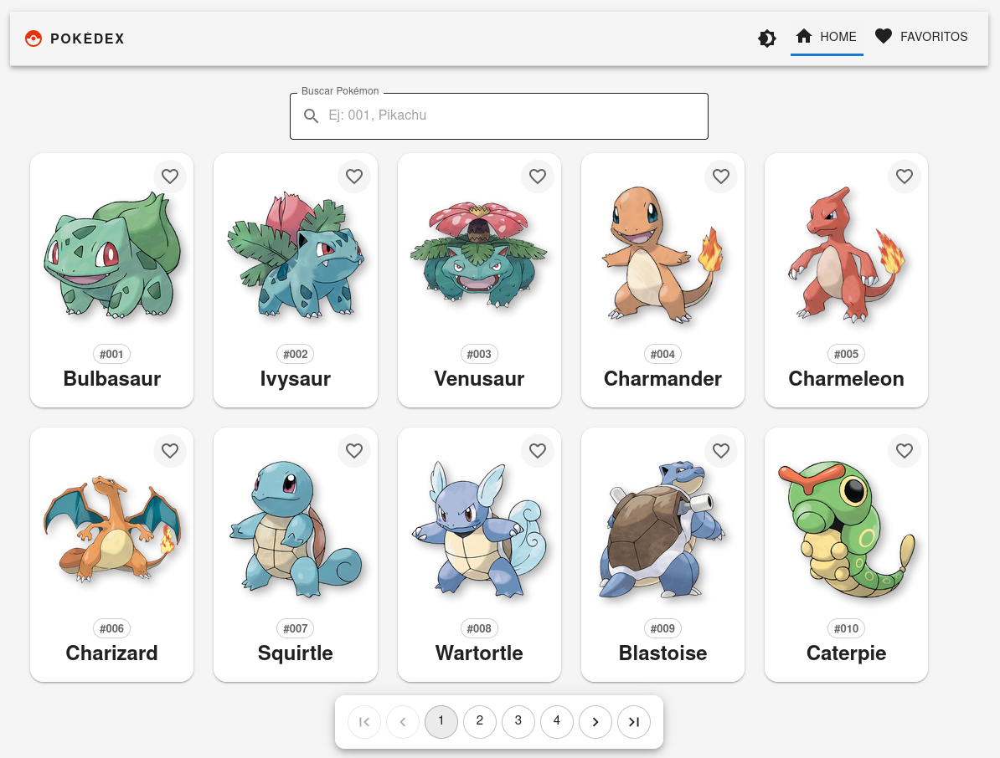
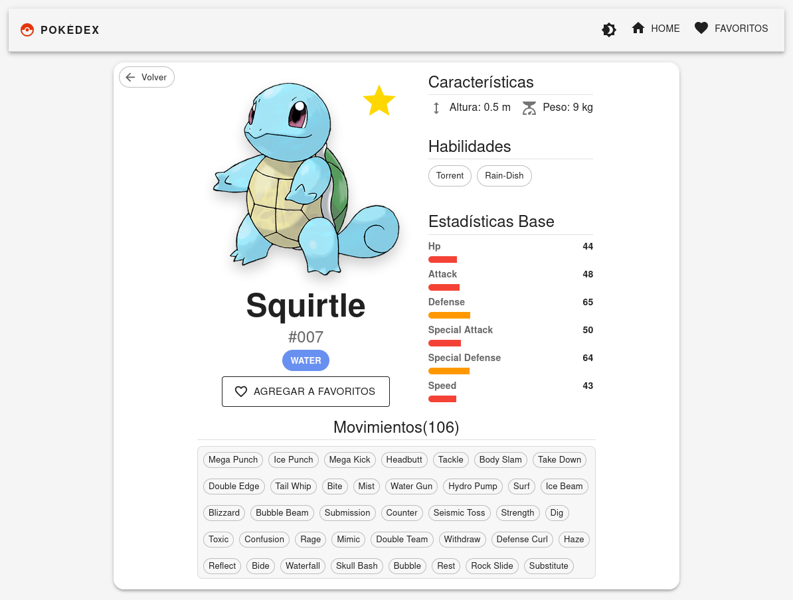
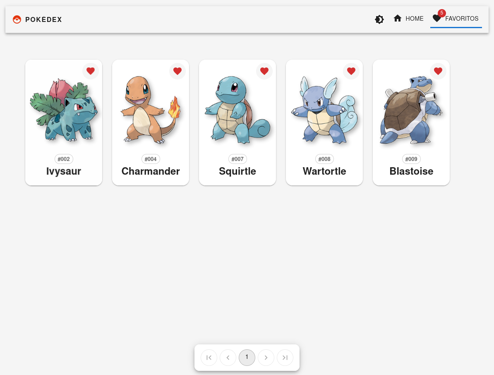

# 🔴 Pokédex


Una aplicación de Pokédex, interactiva y responsiva para explorar la primera y
segunda generación de Pokémon con una experiencia de usuario fluida, soporte
para temas (claro/oscuro) y gestión de favoritos.

## 📸 Vistazo Rápido

### Pantalla Principal (Home)
Búsqueda en tiempo real y paginación personalizada.


### Detalle del Pokémon
Estadísticas, habilidades, movimientos y alternancia de versión Shiny.


### Gestión de Favoritos
Guarda tus Pokémon preferidos localmente.


## ✨ Características Principales

* **⚡ Búsqueda Instantánea:** Filtra Pokémon por nombre en tiempo real sin recargar la página.
* **🌙 Dark Mode / Light Mode:** Cambio de tema global que persiste en el navegador.
* **❤️ Sistema de Favoritos:** Agrega y elimina Pokémon de tu lista personal (persistente con LocalStorage).
* **📊 Stats & Moves:** Visualización gráfica de estadísticas base y lista scrollable de movimientos.
* **📱 Diseño Responsive:** Interfaz adaptada para móviles, tablets y escritorio usando Material UI Grid.
* **🎨 UI Intuitiva:** Chips de colores oficiales para cada tipo de Pokémon y navegación fluida.

## 🚀 Tecnologías Utilizadas

* **Core:** [React](https://react.dev/) + [TypeScript](https://www.typescriptlang.org/)
* **Build Tool:** [Vite](https://vitejs.dev/)
* **UI Framework:** [Material UI (MUI)](https://mui.com/)
* **Routing:** [React Router DOM](https://reactrouter.com/)
* **Data Fetching:** API nativa (Fetch) consumiendo [PokéAPI](https://pokeapi.co/)
* **Linting:** [ESLint](https://eslint.org/)

## 🛠️ Instalación y Uso

Este proyecto utiliza `pnpm` como gestor de paquetes (aunque funciona tambien con `npm`).

1.  **Clonar el repositorio**
    ```bash
    git clone [https://github.com/JosephBapt/pokedex-app.git](https://github.com/JosephBapt/pokedex-app.git)
    cd pokedex-app
    ```

2.  **Instalar dependencias**
    ```bash
    pnpm install
    # O si usas npm:
    npm install
    ```

3.  **Iniciar servidor de desarrollo**
    ```bash
    pnpm dev
    # O si usas npm:
    npm run dev
    ```

4.  **Linting (Opcional)**
    Para verificar y corregir el estilo del código:
    ```bash
    npm run lint:fix
    ```

## 📦 Build y Producción

Para generar la versión para producción:

1.  **Construir el proyecto:**
    ```bash
    pnpm build
    # O si usas npm:
    npm run build
    ```
    Esto creará una carpeta `dist/` en la raíz de tu proyecto con todos los archivos estáticos.

2.  **Previsualizar la producción (Local):**
    Antes de subirlo, puedes probar cómo se comportará la versión final en tu máquina:
    ```bash
    pnpm preview
    # O si usas npm:
    npm run preview
    ```

3.  **Despliegue (Deploy):**
    La carpeta `dist/` es lo único que necesitas subir a tu hosting.
    * **Vercel / Netlify:** Simplemente conecta este repositorio y detectarán automáticamente el comando de build (`vite build` o `pnpm build` o  `npm run build`) y la carpeta de salida (`dist`).
    * **GitHub Pages:** Puedes desplegar la carpeta `dist` usando la acción de GitHub Pages.

## 📂 Estructura del Proyecto

```bash
src/
├── components/      # Componentes reutilizables (PokemonCard, Navbar, etc.)
├── context/         # Context API (ThemeContext, FavoritesContext)
├── hooks/           # Custom Hooks para lógica reutilizable
├── pages/           # Vistas principales (Home, PokemonDetails, Favorites)
├── services/        # Lógica de consumo de API (api.ts)
└── types/           # Definiciones de TypeScript (Interfaces)
```
